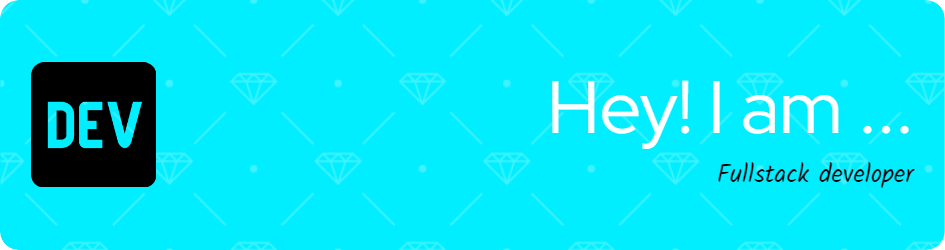

<h1 align="center">Hi 👋, I'm Kimia</h1>
<h3 align="center">Frontend developer from Tehran</h3>

  

- 📫 Reach me by **Kimiya.Khoshnod@gmail.com**

<h3 align="left">Connect with me:</h3>

<h3 align="left">Languages and Tools:</h3>

           

